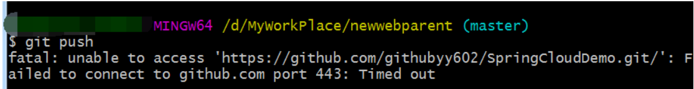

# 常见问题

## 尽量避免使用绝对路径

图片尽量避免使用绝对路径，改为相对路径

```markdown
  如果图片与.md文件在同一目录下，那么相对路径这样表示

  1为md所在文件夹下的文件夹

  父路径由..表示
```

## 出现无法 push/pull 的现象

### port  ==443==：Timed out

#### 错误信息

`Failed to connect to github.com port 443: Timed out`

如下图所示

	

git提示Failed to connect to github.com port 443: Timed out

这边我发现我的网络是没有问题，且github也能正常访问

#### 原因

443 报错是因为出现了网络问题：

1. 是否使用了代理
2. 代理的节点是否有问题
3. git 是否认定该代理是安全的

#### 解决方案一


#### 解决方案二

输入

```bash
git config --global http.proxy http://127.0.0.1:7890

git config --global https.proxy http://127.0.0.1:7890
```

上述代码块中的 http 网址来自于

	

获取方法参照 [<u>解决方案一</u>](#解决方案一)

### errno ==10054==

#### 错误信息

`error: RPC failed; curl 28 OpenSSL SSL_read: Connection was reset, errno 10054` 

如下图所示


#### 原因

这是服务器的SSL证书没有经过第三方机构的签署，所以报错

#### 解决方案

`git config --global http.sslVerify "false"`

### warning: LF will be replaced by ==CRLF==

#### 错位信息

`warning: LF will be replaced by CRLF`


#### 原因

- Mac os 和 linux 系统用 LF 换行（即\n）
- windows 系统用 CRLF 换行（即 \r\n）


- 所以 Unix/Mac 系统下的文件在 Windows 里打开的话，所有文字会变成一行
- 而Windows里的文件在Unix/Mac下打开的话，在每行的结尾可能会多出一个^M符号
- Linux保存的文件在windows上用记事本看的话会出现黑点

#### 解决方案

使用` git config --global core.autocrlf true ` 来自动转换换行符和回车换行符

### ==Another== git process seems to be running in this repository

#### 错误信息

```bash
fatal: Unable to create 'D:/Github Responsitories/hdujsjtw.zuzhi/.git/index.lock': File exists.

Another git process seems to be running in this repository, e.g.
an editor opened by 'git commit'. Please make sure all processes
are terminated then try again. If it still fails, a git process
may have crashed in this repository earlier:
remove the file manually to continue.
```

	

#### 原因

Git在使用过程中遭遇了奔溃，部分被上锁资源没有被释放导致的。

#### 解决方案

进入项目文件夹下的 .git文件中（显示隐藏文件夹或rm .git/index.lock）删除index.lock文件即可。