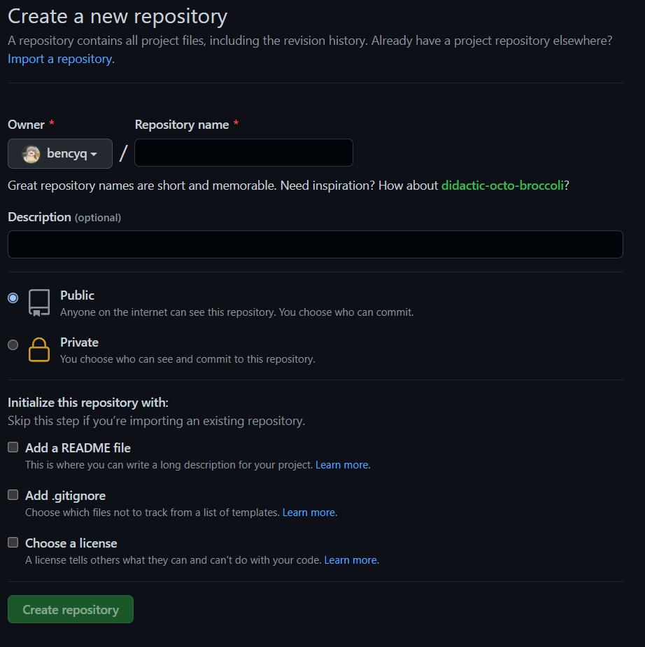

# git 本地仓库推送到远程

## 1. 在Github上新建一个仓库

注意，如果新建的仓库包含 README文件，则连接后要先pull再push

## 2. 本地操作

- `git init`：初始化本地文件
- `touch .gitignore` ：设置不需要的文件
- `git add`、`git commit`

## 3. 连接

`git remote add origin https://github.com/darenone/miniProductionLine.git`

这里特别注意，我们第一次`push`的时候,加上`-u`参数,Git就会把本地的`main`分支和远程的`main`分支进行关联起来,我们以后的`push`操作就不再需要加上`-u`参数了

`git push -u origin main`

完成

