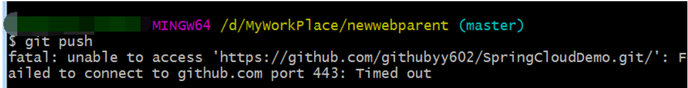
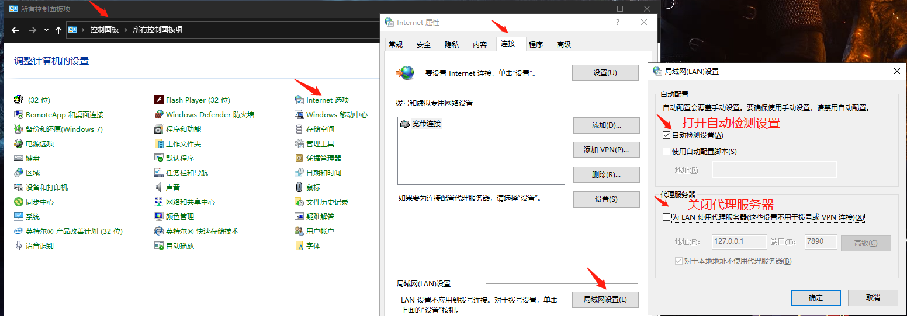
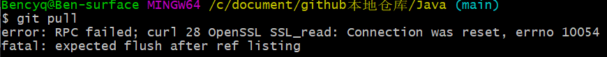

# 注意事项

## 尽量避免使用绝对路径

图片尽量避免使用绝对路径，改为相对路径

```markdown
  如果图片与.md文件在同一目录下，那么相对路径这样表示

  1为md所在文件夹下的文件夹

  父路径由..表示
```

## 出现无法 push/pull 的现象

### port  ==443==：Timed out

#### 错误信息

`Failed to connect to github.com port 443: Timed out`

如下图所示

	

git提示Failed to connect to github.com port 443: Timed out

这边我发现我的网络是没有问题，且github也能正常访问

#### 原因

默认使用了代理

#### 解决方案



### errno ==10054==

#### 错误信息

`error: RPC failed; curl 28 OpenSSL SSL_read: Connection was reset, errno 10054` 

如下图所示



#### 原因

这是服务器的SSL证书没有经过第三方机构的签署，所以报错

#### 解决方案

`git config --global http.sslVerify "false"`