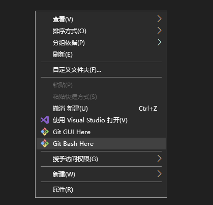

# git本地操作

## 提交文件的基本流程

工作区-->暂存区-->仓库

## 初始化一个新的Git仓库

### 示例

在桌面上新建文件夹，进入后右键，点击Git Bash Here

 

### 常用指令

1. ls 查看当前文件
2. pwd 查看当前目录

### 基本信息设置

```bash
git config --global user.name 'bencyq'  # 配置用户名

git config --global user.email '876687019@qq.com'  # 配置邮箱

git config --list  # 查看设置
```

	

### 创建Git仓库

在文件夹内新建一个test文件夹，在test文件夹目录下输入

```bash
git init  # 初始化仓库，会生成一个隐藏文件'.git'
```

	

### 向仓库中添加文件

```bash
git status  # 查看仓库的信息
touch test.txt  # 生成一个文件
git test.txt  # 将文件提交到暂存区
git commit -m '添加test文件'  # 将文件提交到仓库（m是添加描述）
```

### 修改仓库文件

```bash
vim test.txt  # 修改仓库文件
:wq  # 修改完后点esc，输入:wq，再按enter来保存
cat test.txt  # 查看文件内容
git add text.txt  # 修改后，重新将文件从工作区添加到暂存区
git add --all  # 将全部文件发送到暂存区
git commit -m '修改过的文件'  # 将文件提交到仓库
```

		

### 删除文件

```bash
rm test.txt  # 删除工作区的文件
git rm test.txt  # 将删除指令提交到暂存区  命令删除一个目录中的一个或者多个文件或者目录，只用rm命令不会删除目录，通常文件通常可以恢。
git rm -rf  # 删除当前目录下的所有文件,这个命令很危险，应避免使用。
git commit -m '删除test.txt'  # 允许暂存区的操作，删除仓库文件
```

